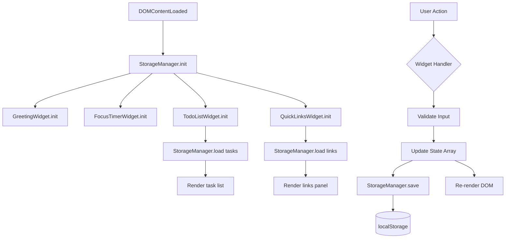

# Design Document: Todo List Dashboard

## Overview

The Todo List Dashboard is a single-page, client-side web application built with plain HTML, CSS, and Vanilla JavaScript — no frameworks, no build tools, no backend. It runs entirely in the browser and persists all user data via the `localStorage` API.

The dashboard is composed of four independent widgets rendered on a single HTML page:

1. **Greeting Widget** — displays the current time (HH:MM, 24-hour), full date, and a time-based greeting.
2. **Focus Timer** — a 25-minute Pomodoro-style countdown with Start, Stop, and Reset controls.
3. **Todo List** — a full CRUD task manager (add, edit, complete, delete) with localStorage persistence.
4. **Quick Links** — a user-defined panel of labelled URL shortcut buttons with localStorage persistence.

### Key Design Decisions

- **No framework constraint** drives a module-per-widget architecture using plain ES6 modules (or an IIFE pattern if module support is a concern). Each widget owns its own DOM manipulation and state.
- **Single JS file (`js/app.js`)** as required by TC-4. All widget logic is co-located in one file, separated by clearly commented sections and factory functions.
- **Single CSS file (`css/styles.css`)** as required by TC-4 and Requirement 12.3.
- **Storage_Manager** is a thin wrapper around `localStorage` that centralises all read/write operations, making it easy to swap the persistence layer in the future.
- **Event delegation** is used on list containers (todo list, quick links panel) to avoid attaching per-item listeners and to handle dynamically added items efficiently.

---

## Architecture

The application follows a **widget-based MVC-lite** pattern within a single HTML page. There is no routing, no virtual DOM, and no reactive data binding. State is held in plain JavaScript objects/arrays and the DOM is updated imperatively.

```
index.html
├── css/styles.css          (all visual styling)
└── js/app.js               (all application logic)
    ├── StorageManager      (localStorage read/write)
    ├── GreetingWidget      (time, date, greeting)
    ├── FocusTimerWidget    (countdown timer)
    ├── TodoListWidget      (task CRUD + persistence)
    └── QuickLinksWidget    (link CRUD + persistence)
```

### Initialization Flow

```
DOMContentLoaded
  └── StorageManager.init()
  └── GreetingWidget.init()       → starts setInterval (1 min tick)
  └── FocusTimerWidget.init()     → renders 25:00, binds controls
  └── TodoListWidget.init()       → loads tasks from storage, renders list
  └── QuickLinksWidget.init()     → loads links from storage, renders panel
```

### Data Flow

```
User Action
  └── Widget handler (e.g., addTask)
        ├── Validates input
        ├── Updates in-memory state array
        ├── Calls StorageManager.save(key, data)   → localStorage.setItem
        └── Re-renders affected DOM nodes
```

### Mermaid Diagram



---

## Components and Interfaces

### StorageManager

Centralises all `localStorage` interactions. Operates synchronously (as `localStorage` is synchronous).

```javascript
const StorageManager = {
  KEYS: {
    TASKS: 'tdl_tasks',
    LINKS: 'tdl_links',
  },

  // Returns parsed value or null on missing/corrupt data
  load(key),

  // Serialises value to JSON and writes to localStorage
  save(key, value),
};
```

- `load(key)`: calls `localStorage.getItem(key)`, wraps `JSON.parse` in a try/catch, returns `null` on any error.
- `save(key, value)`: calls `localStorage.setItem(key, JSON.stringify(value))`.

### GreetingWidget

Owns the greeting section of the DOM. Reads the system clock on init and every minute thereafter.

```javascript
const GreetingWidget = {
  init(),          // binds DOM refs, starts interval
  _render(),       // updates time, date, greeting text
  _getGreeting(hour),  // returns greeting string for given hour
  _formatTime(date),   // returns HH:MM string or '--:--' on error
  _formatDate(date),   // returns "Weekday, D Month YYYY" string
};
```

- Uses `setInterval` with a 60-second period, aligned to the next minute boundary on startup to minimise drift.
- Falls back to `"Welcome"` / `"--:--"` if `new Date()` returns an invalid date.

### FocusTimerWidget

Owns the timer section. Manages a single `setInterval` handle for the countdown.

```javascript
const FocusTimerWidget = {
  _remaining: 1500,   // seconds (25 * 60)
  _intervalId: null,
  _isRunning: false,

  init(),
  _render(),
  _start(),
  _stop(),
  _reset(),
  _tick(),            // decrements _remaining, calls _render, checks completion
  _formatTime(seconds),  // returns MM:SS string
};
```

- `_start()` is a no-op if `_isRunning === true` (Requirement 2.7).
- `_stop()` is a no-op if `_isRunning === false` (Requirement 2.8).
- On reaching 00:00, `_tick()` clears the interval, sets `_isRunning = false`, applies the completion CSS class, and renders "Session complete!" (Requirement 2.6).

### TodoListWidget

Owns the todo section. Maintains an in-memory `tasks` array as the source of truth.

```javascript
const TodoListWidget = {
  _tasks: [],          // Array<Task>
  _editingId: null,    // id of task currently in edit mode, or null

  init(),
  _loadFromStorage(),
  _saveToStorage(),
  _render(),           // full re-render of the list
  _addTask(description),
  _deleteTask(id),
  _toggleTask(id),
  _startEdit(id),
  _confirmEdit(id, newDescription),
  _cancelEdit(),
  _renderTask(task),   // returns a DOM element for a single task
  _handleListClick(event),  // event delegation handler
};
```

- `_addTask` trims input, rejects empty/whitespace-only strings and strings > 200 chars (Requirements 3.3, 3.5).
- `_startEdit` cancels any in-progress edit before opening a new one (Requirement 4.6).
- `_confirmEdit` trims the new value; rejects empty/whitespace-only (Requirement 4.3–4.4).
- `_saveToStorage` is called after every mutating operation; it must complete within 300 ms (Requirement 7.1).

### QuickLinksWidget

Owns the quick links section. Maintains an in-memory `links` array.

```javascript
const QuickLinksWidget = {
  _links: [],          // Array<Link>

  init(),
  _loadFromStorage(),
  _saveToStorage(),
  _render(),
  _addLink(label, url),
  _deleteLink(id),
  _openLink(url),
  _validateUrl(url),   // returns true if url starts with http:// or https://
  _renderLink(link),   // returns a DOM element for a single link
  _handlePanelClick(event),
};
```

- `_addLink` validates that both label and URL are non-empty and that the URL starts with `http://` or `https://` (Requirements 9.3–9.5).
- `_openLink` checks the URL prefix before calling `window.open(url, '_blank')` (Requirement 8.2–8.3).
- Labels are truncated to 50 characters in the rendered button text (Requirement 8.1).
- `_saveToStorage` must complete within 300 ms for add (Requirement 9.6) and 100 ms for delete (Requirement 10.3).

---

## Data Models

### Task

```javascript
/**
 * @typedef {Object} Task
 * @property {string}  id          - Unique identifier (e.g., crypto.randomUUID() or Date.now().toString())
 * @property {string}  description - Task text, 1–200 characters (trimmed)
 * @property {boolean} completed   - Completion status
 * @property {number}  createdAt   - Unix timestamp (ms) of creation
 */
```

Example:
```json
{
  "id": "1746432000000",
  "description": "Write the design document",
  "completed": false,
  "createdAt": 1746432000000
}
```

### Link

```javascript
/**
 * @typedef {Object} Link
 * @property {string} id        - Unique identifier
 * @property {string} label     - Display label, 1–50 characters (truncated in UI)
 * @property {string} url       - Full URL starting with http:// or https://
 * @property {number} createdAt - Unix timestamp (ms) of creation
 */
```

Example:
```json
{
  "id": "1746432001000",
  "label": "GitHub",
  "url": "https://github.com",
  "createdAt": 1746432001000
}
```

### localStorage Schema

| Key | Value Type | Description |
|---|---|---|
| `tdl_tasks` | `JSON string → Task[]` | Ordered array of all tasks |
| `tdl_links` | `JSON string → Link[]` | Ordered array of all quick links |

---


## Correctness Properties

*A property is a characteristic or behavior that should hold true across all valid executions of a system — essentially, a formal statement about what the system should do. Properties serve as the bridge between human-readable specifications and machine-verifiable correctness guarantees.*

The following properties are derived from the acceptance criteria. They target the pure logic functions (formatting, validation, state transitions, serialization) that are separable from the DOM. Property-based tests will be implemented using [fast-check](https://github.com/dubzzz/fast-check) (a JavaScript PBT library), configured to run a minimum of 100 iterations per property.

---

### Property 1: Time formatting always produces HH:MM

*For any* valid `Date` object, `_formatTime(date)` SHALL return a string matching the pattern `HH:MM` where HH is a zero-padded 24-hour value (00–23) and MM is a zero-padded minute value (00–59).

**Validates: Requirements 1.1**

---

### Property 2: Date formatting always produces the correct pattern

*For any* valid `Date` object, `_formatDate(date)` SHALL return a string in the format `"Weekday, D Month YYYY"` where Weekday is the correct English day name, D is the day of the month (not zero-padded), Month is the correct English month name, and YYYY is the four-digit year.

**Validates: Requirements 1.3**

---

### Property 3: Greeting is correct for all hours

*For any* integer hour in the range 0–23, `_getGreeting(hour)` SHALL return exactly `"Good Morning"` for hours 5–11, `"Good Afternoon"` for hours 12–17, `"Good Evening"` for hours 18–20, and `"Good Night"` for hours 21–23 and 0–4.

**Validates: Requirements 1.4, 1.5, 1.6, 1.7**

---

### Property 4: Timer time formatting always produces MM:SS

*For any* integer number of seconds in the range 0–1500, `_formatTime(seconds)` SHALL return a string matching the pattern `MM:SS` where MM is a zero-padded minutes value and SS is a zero-padded seconds value, and the total represented time equals the input seconds.

**Validates: Requirements 2.2, 2.3**

---

### Property 5: Stop preserves remaining time

*For any* timer state with a remaining time value `t` (0 < t ≤ 1500), calling `_stop()` SHALL leave the remaining time unchanged at `t`.

**Validates: Requirements 2.4**

---

### Property 6: Reset always returns to 1500 seconds

*For any* timer state (running or stopped, any remaining time value), calling `_reset()` SHALL set the remaining time to exactly 1500 seconds (25:00) and set `_isRunning` to `false`.

**Validates: Requirements 2.5**

---

### Property 7: Start is idempotent when already running

*For any* running timer state with remaining time `t`, calling `_start()` again SHALL leave the remaining time unchanged at `t` and SHALL NOT create an additional interval.

**Validates: Requirements 2.7**

---

### Property 8: Stop is idempotent when already stopped

*For any* stopped timer state with remaining time `t`, calling `_stop()` SHALL leave the remaining time unchanged at `t` and SHALL NOT change `_isRunning`.

**Validates: Requirements 2.8**

---

### Property 9: Adding a valid task grows the list by one

*For any* task list and any non-empty, non-whitespace-only string of length ≤ 200 characters, calling `_addTask(description)` SHALL increase the length of `_tasks` by exactly 1, and the new task SHALL have `completed = false` and a `description` equal to the trimmed input.

**Validates: Requirements 3.2**

---

### Property 10: Whitespace-only and empty task descriptions are rejected

*For any* string composed entirely of whitespace characters (including the empty string), calling `_addTask(description)` SHALL leave `_tasks` unchanged (same length and same contents).

**Validates: Requirements 3.3**

---

### Property 11: Task descriptions exceeding 200 characters are rejected

*For any* string with length strictly greater than 200 characters, calling `_addTask(description)` SHALL leave `_tasks` unchanged.

**Validates: Requirements 3.5**

---

### Property 12: Task list order is preserved in rendering

*For any* array of tasks, the order of task elements rendered in the DOM SHALL match the order of tasks in the `_tasks` array (first task in array → first item in DOM).

**Validates: Requirements 3.4**

---

### Property 13: Edit confirmation trims and validates

*For any* task and any string value submitted as an edit: if the trimmed value is non-empty, `_confirmEdit` SHALL update the task's description to the trimmed value; if the trimmed value is empty or whitespace-only, `_confirmEdit` SHALL leave the task's description unchanged.

**Validates: Requirements 4.3, 4.4**

---

### Property 14: Cancel edit always restores original description

*For any* task with description `d` and any edit input value, calling `_cancelEdit()` SHALL restore the task's description to `d` and exit edit mode.

**Validates: Requirements 4.5**

---

### Property 15: At most one task is in edit mode at any time

*For any* task list, after calling `_startEdit(id)` for any task `id`, the count of tasks in edit mode SHALL be exactly 1 (or 0 if the task does not exist).

**Validates: Requirements 4.6**

---

### Property 16: Toggling completion is a round-trip

*For any* task with completion status `s`, toggling it twice (calling `_toggleTask(id)` twice) SHALL return the task's completion status to `s`.

**Validates: Requirements 5.2, 5.3**

---

### Property 17: Deleting a task reduces list length by one

*For any* task list containing at least one task, deleting any task by its `id` SHALL reduce the length of `_tasks` by exactly 1, and the deleted task SHALL no longer appear in `_tasks`.

**Validates: Requirements 6.3**

---

### Property 18: Cancelling deletion leaves the list unchanged

*For any* task list, if the user cancels a delete confirmation, `_tasks` SHALL remain identical in length and content to its state before the delete was initiated.

**Validates: Requirements 6.4**

---

### Property 19: StorageManager round-trip preserves data

*For any* array of `Task` objects or `Link` objects, calling `StorageManager.save(key, data)` followed by `StorageManager.load(key)` SHALL return an array that is deeply equal to the original array (same length, same order, same field values).

**Validates: Requirements 7.3, 8.4**

---

### Property 20: Link label truncation

*For any* link label string, the text displayed on the rendered link button SHALL be at most 50 characters long. If the original label is ≤ 50 characters, the displayed text SHALL equal the original label exactly.

**Validates: Requirements 8.1**

---

### Property 21: URL validation for opening links

*For any* URL string: if it begins with `http://` or `https://`, `_validateUrl(url)` SHALL return `true`; otherwise it SHALL return `false`.

**Validates: Requirements 8.2, 8.3**

---

### Property 22: Adding a valid link grows the list by one

*For any* link list and any non-empty label and valid URL (starting with `http://` or `https://`), calling `_addLink(label, url)` SHALL increase the length of `_links` by exactly 1.

**Validates: Requirements 9.2**

---

### Property 23: Invalid link inputs are rejected

*For any* combination of inputs where the label is empty, the URL is empty, or the URL does not begin with `http://` or `https://`, calling `_addLink(label, url)` SHALL leave `_links` unchanged.

**Validates: Requirements 9.3, 9.4, 9.5**

---

### Property 24: Deleting a link reduces list length by one

*For any* link list containing at least one link, deleting any link by its `id` SHALL reduce the length of `_links` by exactly 1, and the deleted link SHALL no longer appear in `_links`.

**Validates: Requirements 10.2**

---

## Error Handling

### StorageManager

| Scenario | Handling |
|---|---|
| `localStorage.getItem` returns `null` (key not found) | Return `null`; callers treat `null` as empty state |
| `JSON.parse` throws (corrupt data) | Catch exception, log warning to console, return `null` |
| `localStorage.setItem` throws (storage quota exceeded) | Catch exception, log error to console, do not crash the app |

### GreetingWidget

| Scenario | Handling |
|---|---|
| `new Date()` returns an invalid date | Detect with `isNaN(date.getTime())`, display `"--:--"` and `"Welcome"` |

### FocusTimerWidget

| Scenario | Handling |
|---|---|
| `setInterval` callback fires after `_remaining` is already 0 | Guard: `if (_remaining <= 0) { _stop(); return; }` |

### TodoListWidget

| Scenario | Handling |
|---|---|
| Empty/whitespace task description | Reject silently, retain focus on input |
| Task description > 200 characters | Reject, display character limit message |
| Edit confirmed with empty/whitespace value | Reject, retain original description in edit field |
| Corrupt task data in localStorage | StorageManager returns `null`; widget initialises with `[]` |

### QuickLinksWidget

| Scenario | Handling |
|---|---|
| Empty label on add | Reject, display "Label is required" inline error |
| Empty URL on add | Reject, display "URL is required" inline error |
| Invalid URL on add | Reject, display "URL must start with http:// or https://" inline error |
| Invalid URL on open | Display "Invalid URL" inline error, do not navigate |
| Corrupt link data in localStorage | StorageManager returns `null`; widget initialises with `[]` |

---

## Testing Strategy

### Overview

Testing is split into two complementary layers:

1. **Unit / Property-Based Tests** — test pure logic functions in isolation (no DOM, no localStorage).
2. **Integration / Smoke Tests** — test the assembled application in a real browser environment.

Since the entire application lives in a single `js/app.js` file, the pure logic functions (formatters, validators, state transition logic, StorageManager) must be exported or exposed in a way that allows them to be imported by the test suite. The recommended approach is to wrap each widget in a factory function that accepts injected dependencies (e.g., a mock `localStorage`) and returns the widget's public API.

### Property-Based Testing

**Library**: [fast-check](https://github.com/dubzzz/fast-check) (JavaScript, no build tools required — can be loaded via CDN in a test HTML file, or via npm for a Node.js test runner).

**Runner**: [Vitest](https://vitest.dev/) (or Jest) for Node.js-based test execution.

**Configuration**: Each property test MUST run a minimum of **100 iterations** (`numRuns: 100` in fast-check).

**Tag format**: Each property test MUST include a comment in the format:
```
// Feature: todo-list-dashboard, Property N: <property_text>
```

**Properties to implement** (one test per property):

| Test | Property | fast-check Arbitraries |
|---|---|---|
| P1 | Time formatting HH:MM | `fc.date()` |
| P2 | Date formatting pattern | `fc.date()` |
| P3 | Greeting for all hours | `fc.integer({ min: 0, max: 23 })` |
| P4 | Timer MM:SS formatting | `fc.integer({ min: 0, max: 1500 })` |
| P5 | Stop preserves remaining time | `fc.integer({ min: 1, max: 1500 })` |
| P6 | Reset returns to 1500 | `fc.record({ remaining: fc.integer({min:0,max:1500}), isRunning: fc.boolean() })` |
| P7 | Start idempotent when running | `fc.integer({ min: 1, max: 1500 })` |
| P8 | Stop idempotent when stopped | `fc.integer({ min: 0, max: 1500 })` |
| P9 | Add valid task grows list | `fc.array(taskArb), fc.string({minLength:1,maxLength:200}).filter(s => s.trim().length > 0)` |
| P10 | Whitespace task rejected | `fc.array(taskArb), fc.stringOf(fc.constantFrom(' ','\t','\n'))` |
| P11 | Long task rejected | `fc.array(taskArb), fc.string({minLength:201})` |
| P12 | Task order preserved | `fc.array(taskArb, {minLength:1})` |
| P13 | Edit trims and validates | `taskArb, fc.string()` |
| P14 | Cancel edit restores original | `taskArb, fc.string()` |
| P15 | At most one task in edit mode | `fc.array(taskArb, {minLength:2})` |
| P16 | Toggle is round-trip | `taskArb` |
| P17 | Delete reduces list length | `fc.array(taskArb, {minLength:1})` |
| P18 | Cancel delete preserves list | `fc.array(taskArb, {minLength:1})` |
| P19 | StorageManager round-trip | `fc.array(taskArb)`, `fc.array(linkArb)` |
| P20 | Label truncation | `fc.string()` |
| P21 | URL validation | `fc.string()` |
| P22 | Add valid link grows list | `fc.array(linkArb), fc.string({minLength:1}), validUrlArb` |
| P23 | Invalid link inputs rejected | `fc.array(linkArb), invalidLinkInputArb` |
| P24 | Delete link reduces list length | `fc.array(linkArb, {minLength:1})` |

### Unit / Example-Based Tests

Unit tests cover specific examples, edge cases, and behaviors not suited to PBT:

- **GreetingWidget**: Invalid date fallback (`"--:--"`, `"Welcome"`)
- **FocusTimerWidget**: Completion at 00:00 (CSS class applied, "Session complete!" rendered)
- **TodoListWidget**: Edit mode activation (input pre-filled with current description), delete confirmation dialog triggered
- **QuickLinksWidget**: Empty link list renders placeholder message, valid URL opens in new tab
- **StorageManager**: Missing key returns `null`, corrupt JSON returns `null` without throwing

### Integration / Smoke Tests

Run in a real browser (or Playwright/Puppeteer):

- Dashboard loads and renders all four widgets within 2 seconds (Requirement 11.1)
- All persisted data (100 tasks, 50 links) renders correctly on reload (Requirement 11.2)
- DOM updates within 100 ms of user interaction (Requirement 11.2)
- File structure: exactly one CSS file at `css/styles.css`, one JS file at `js/app.js` (Requirements 12.3, 12.4)
- Font size ≥ 14px on body text (Requirement 12.1)
- Colour contrast ≥ 4.5:1 (Requirement 12.2) — verified with axe-core or manual audit

### Test File Structure

```
tests/
├── unit/
│   ├── greeting.test.js       (P1, P2, P3, edge cases)
│   ├── timer.test.js          (P4–P8, edge cases)
│   ├── todo.test.js           (P9–P18, edge cases)
│   ├── quicklinks.test.js     (P20–P24, edge cases)
│   └── storage.test.js        (P19, edge cases)
└── integration/
    └── dashboard.test.js      (smoke + integration tests)
```
